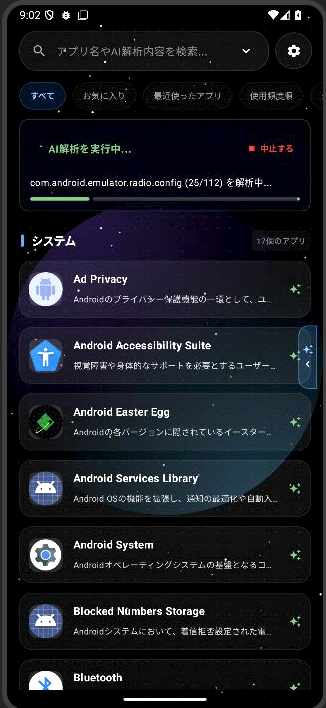
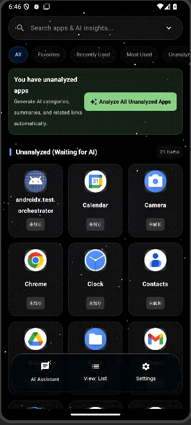
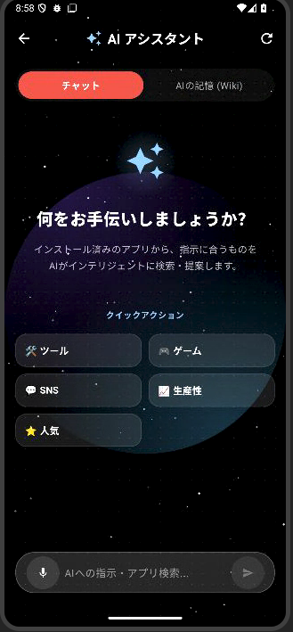

# 🌌 Insight Launcher (インサイト・ランチャー)

<div align="center">
  <p><b>Gemini API を搭載した、AI世代のAndroid向け近未来型ホームランチャー</b></p>
  <a href="https://github.com/dma-cmyk/insight-launcher/releases">
    
  </a>
  
  
</div>

---

**Insight Launcher** は、Google Gemini API を活用し、インストールされているアプリの「意味」や「用途」を自動で解析・スマートに分類する、全く新しいAndroid用ランチャーアプリです。
美しい宇宙空間のダイナミック背景（Space Background）に包まれたUIと、AIアシスタント機能があなたのスマートフォンライフをスマートに彩ります。

> [!NOTE]
> 本アプリは Google AI Studio プロジェクトとしても管理されています。
> AI Studio でアプリを表示：[AI Studio - Insight Launcher](https://ai.studio/apps/56c5aa91-770a-409c-a9d3-57814b978afd)

---

## 📸 スクリーンショット

<div align="center">
  <table border="0">
    <tr>
      <td align="center"><b>リストビュー (List View)</b><br>アプリ詳細とAIの解析結果を表示</td>
      <td align="center"><b>グリッドビュー (Grid View)</b><br>スッキリ並ぶ3列レイアウト（解析バッジ付）</td>
      <td align="center"><b>AIアシスタント (AI Assistant)</b><br>チャット＆AIの記憶(Wiki)管理画面</td>
    </tr>
    <tr>
      <td valign="top"></td>
      <td valign="top"></td>
      <td valign="top"></td>
    </tr>
  </table>
</div>

---

## 👑 アップデート情報

* **🌓 背景輝度解析の初期化タイミングバグの修正 (v1.4.3) [NEW]**
  - Android起動時やViewModelのロード時に、宇宙背景画像の明暗を解析してアプリアイコン名などのテキストコントラスト（白文字/黒文字の動的切替）を自動調整する機能（Luminance Analysis）が、まれにバインディング順序の不整合によって動作しない不具合を修正しました。
  - `_bgLuminance` と `autoContrast` の定義・宣言位置をViewModel内の初期化部上部に整理し、Kotlinの初期化フェーズと完全に同期させることで、背景画像選択時や起動直後の文字色自動コントラスト調整の動作安定性を劇的に高めました。

* **📚 GitHub検索結果リポジトリのリアルタイム自動翻訳 (v1.4.2)**
  - AIアシスタントを通じてGitHub上のオープンソースプロジェクトやコードテンプレートを検索する際、GitHub APIから取得される元の英語の紹介文（`description`）を、Geminiを用いて自動的かつリアルタイムでスマホの表示言語（日本語・韓国語・中国語など）に一括翻訳（`translateGitHubRepos`）する機能を追加しました。
  - 検索結果の上位10件のリポジトリ説明文が一括で自然なローカライズ翻訳へ差し替えられてチャット画面のカードに表示されるため、英語圏のリポジトリ情報も言語の壁を感じずに瞬時に把握できるようになりました。

* **🌐 推奨アプリ説明文の完全ローカライズ追従 (v1.4.1)**
  - AIアシスタント画面で、インストールされていないおすすめ外部アプリ（Playストア推奨アプリ情報）が提案される際、アプリの紹介説明文（`description`）がスマートフォンの表示言語設定（日本語・韓国語・中国語など）に関わらず常に英語で出力されてしまう表記の不整合バグを解消しました。
  - Geminiプロンプト指示およびAPI of JSONスキーマ上の記述説明プロパティに、現在設定されている言語（`$langName`）に完全準拠してテキストを生成するよう明示的な制約を追加。これにより、非英語圏のユーザーに対しても魅力を的確に伝える完全なローカライズ表記でのアプリ提案を実現しました。

* **🎙️ 音声修正AIのローマ字日本語変換対応＆型安全クラッシュ防止 (v1.4.0)**
  - 音声入力時の文字揺れをGeminiで補正する「Voice Input Correction」のプロンプトをさらに賢くアップグレード。Androidの標準音声認識エンジンが稀に出力してしまう「ローマ字表記（例: `githubderanntya`）」や、崩れた仮名混じりの誤認識テキストを、文脈に即した正しい漢字混じりの日本語に高精度で変換・整形できるように指示を最適化しました。
  - AIアシスタントが返す推奨アプリ（`recommendedStoreApps`）情報のパース処理を再設計。Gson/Serializationのパース型エラーによる強制終了を完全に回避するため、型安全な動的キャストとフォールバックロジックによる多重のクラッシュ防止ガードを実装しました。

* **🎙️ AI音声入力の文字揺れ・誤認識の自動AI修正機能 (v1.3.9)**
  - AIアシスタント画面でマイクによる音声入力を行った際、ノイズや文字揺れ（例：「ジェミニ」「MCP」などの固有名詞の聞き取りミス）をそのまま検索クエリにするのではなく、送信前にGeminiを呼び出して自動で正しい表記や文脈に補正（Voice Input Correction）する前処理フローを追加しました。
  - 補正後のクエリをテキスト入力欄に再セットして検索を実行することで、音声でのAIアシスタント対話が極めて高精度で安定したものになりました。
  - また、AI応答JSONの型定義（RecommendedStoreApp）の nullable 指定やスキーマのパース処理をリファクタリングし、アシスタント機能全体の型安全性と堅牢性を劇的に向上させました。

* **🌌 3Dシリンダー（円筒状）回転背景エフェクトへの進化 (v1.3.8)**
  - ホーム画面の横スワイプカテゴリ切替時に、背後の宇宙背景（星雲）がまるで巨大なドラム状の円筒の内側をぐるぐる回り込んでいるかのような、極めて滑らかで没入感のある「3Dシリンダー回転」エフェクトを実装しました。
  - 背景のループ時の継ぎ目（星雲の切れ目）を完全になくすため、通常の背景と反転（ミラー）背景をX軸方向に3枚連結（正常→反転→正常）して貼り合わせる「シームレス連結（Tiling & Mirroring）」手法を採用。
  - さらに、画面の左右両端にリアルな暗いグラデーションシャドウを落とす「円筒状陰影レイヤー (Cylindrical Shading Overlay)」を重ねることで、背景画像が奥へ回り込んでいく立体感を劇的に向上させました。

* **🌌 宇宙背景のダイナミック回転パララックス機能 (v1.3.7)**
  - ホーム画面を横スワイプしてカテゴリを切り替える際、背後の宇宙（星雲）背景画像が単純にスクロール（パン）するだけだった挙動を、スワイプ進行度に合わせてダイナミックに時計回り・反時計回りに回転（最大45度）するアニメーションへアップグレードしました。
  - 回転時に画面端に黒い余白（星雲の切れ目）が露出するのを防ぐため、背景画像のズームスケールを `1.15倍` から `2.2倍` に引き上げて対角線領域を完全にカバー。スクロール位置のトラッキング感度も改善し、よりダイナミックで吸い込まれるようなSF的3D演出を実現しました。

* **💫 お気に入りドラッグ＆ドロップ並び替えのチラつき防止 (v1.3.6)**
  - 「FAVORITE (お気に入り)」カテゴリ内のアプリアイコンをドラッグ＆ドロップで並び替える（リオーダリング）際、アイコンが激しくチラついたり並び順が飛び飛びになってしまう表示バグを解消しました。
  - 位置検出基準を親コンポーネント基準（`boundsInParent`）から画面ウィンドウ基準（`boundsInWindow`）に変更し、Composeの `key(app.packageName)` をアイテムに紐付けることで、ドラッグ中もレンダリング状態が一貫して保持され、直感的で滑らかに並び替えられるよう操作感を大幅に向上させました。

* **🧠 AI解析・カテゴリ分類のカスタム指示機能の追加 (v1.3.5)**
  - AIによるアプリの自動分類・解析時に、ユーザーが独自のプロンプト指示（例：「ゲームはRPGやパズルのように細分化する」「大まかに5つのカテゴリにのみ分類する」など）を設定できる入力欄を設定（Settings）画面に追加しました。
  - ワンタップで設定できる便利な指示サンプルボタン（Example 1 / Example 2）を搭載。
  - カスタム指示の適用に合わせて、既存の全アプリ分類情報を瞬時に再分類・再解析できる「一括再解析」および「順次再解析」の2つの実行ボタンを実装しました。
  - 設定および操作文は、日本語・英語・韓国語・中国語のすべての表示言語に完全対応（ローカライズ）されています。

* **⚙️ アイコンなしシステムアプリの除外切替機能 (v1.3.4)**
  - アプリアイコンや起動用のIntentを持たないバックグラウンドのシステムアプリや各種サービスを、ランチャーのアプリ一覧や AI による自動解析の対象から除外できるトグルスイッチを設定（Settings）画面に追加しました。
  - デフォルトは「オフ（含めない）」に設定されており、無駄なシステムプロセスがアプリ一覧に並ばず、よりクリーンで実用的なホーム画面を提供します。
  - 設定項目および説明文は、日本語・英語・韓国語・中国語のすべての設定言語に対応（ローカライズ）されています。
  - AIアシスタントの `search_installed_apps` MCP ツール実行時にも、この設定値が適用されるように連動させました。

* **⚙️ MCPツール連携の安定化 & ビルドエラー等の修正 (v1.3.3)**
  - AIアシスタントにおけるMCPツール呼び出し時、空のパラメータ（Schema）を要求するツールの登録時にGemini APIで発生するエラーを防ぐため、スキーマパラメータのフィルタリング処理を追加しました。
  - MCPツール実行結果（JSON文字列等）を Map 構造に適切にデシリアライズし、Gemini APIがツールの実行内容をより正確に解釈できるように改善しました。
  - おすすめストアアプリ（`recommendedStoreApps`）のデシリアライズ時の型安全性を確保し、安全にマッピングできるように修正しました。
  - お気に入り並び替え時に、`Collections.swap` 呼び出しが未解決参照となっていたコンパイルエラーを修正しました。また、韓国語のリスト表示切替ラベル of 誤字（`보기: リスト` から `보기: 리스트`）を修正しました。

* **🌐 AI解析カテゴリのローカライズ挙動の安定化 (v1.3.2)**
  - Gemini API によるアプリ自動解析時、出力される「アプリ分類カテゴリ名」（例: 生産性、ソーシャル、ゲーム、エンターテイメントなど）が設定されたユーザー言語（日本語・韓国語・中国語）に正しく翻訳（ローライズ）されず、英語のまま出力されてしまうバグを修正しました。
  - プロンプトに指定言語別のカテゴリ命名具体例を動的に埋め込み、出力フォーマットを厳密に指示することで、カテゴリ分類結果の多言語ローカライズの信頼性を大幅に向上させました。

* **🌌 フローティングドックの位置微調整 (v1.3.1)**
  - ホーム画面に搭載された「フローティングナビゲーションドック」の底部余白パディングを `32.dp` から `12.dp` に微調整しました。これにより、デバイスのジェスチャーバーや3ボタンナビゲーションと重なりにくくなり、ホーム画面全体のレイアウトバランスとタップ操作の正確性が向上しました。

* **🌌 フローティングナビゲーションドック of 搭載 (v1.3.0)**
  - ホーム画面の下部中央に、近未来デザインの「フローティングナビゲーションドック」を追加しました。
  - 主要な3つのアクションである「AIアシスタント画面の起動」「表示レイアウト（グリッド/リスト）のトグル切り替え」「設定画面の表示」へ、どのカテゴリ画面からでもワンタップでアクセスできるようになりました。
  - ドックバーの背景透過やグラデーションボーダーなど、SFテーマに溶け込む美しいデザインを採用。また、ドックと背後のコンテンツが重ならないよう、リスト表示やグリッド表示の底部余白を `130.dp` に最適化しました。

* **⚡ Embeddingモデルの動的適用 & 解析レートリミット対策 (v1.2.2)**
  - これまで固定値（`text-embedding-004`）だったベクトル作成（Embedding）モデルを、設定（Settings）画面で指定されたモデル（例: `gemini-embedding-001` 等）に動的に切り替えて処理・表示するように改善しました。
  - セマンティック検索や、不足ベクトルのバックフィル処理時にも、設定された Embedding モデルが正しく統一して適用されるように修正しました。
  - アプリ解析時の Embedding リクエストの直前に `delay(800)`（0.8秒の待機）を追加し、特に一括解析（バルク）時に Embedding API の瞬間的なリクエスト制限（バーストレートリミット）にかかりづらいよう安定性を向上しました。

* **⚡ AI解析ステータス表示の詳細化 & ページャーバグの修正 (v1.2.1)**
  - アプリ解析の実行中に、現在使用している Gemini モデル名やベクトル生成中（`text-embedding-004`）などの詳細な進捗状況を、ステータスエリアにリアルタイム表示するよう改善しました。
  - ホーム画面の進捗状況テキストの行数制限を最大4行まで拡張し、複数行にわたる詳細なステータス情報を途切れることなく見やすく表示できるようになりました。
  - アプリ解析やカテゴリ統合等によってカテゴリ一覧（`categories`）が動的に変化した際、無限スクロールページャーの表示と選択中のカテゴリフィルターがずれるバグを修正。変化検知時に自動でページャーを最適な位置へと再同期させる LaunchedEffect 処理を追加しました。

* **⚡ 高速一括AI解析機能 (Bulk Analysis) の搭載と動作改善 (v1.2.0)**
  - 未解析のアプリをまとめて1回のAPIリクエストで高速に解析する「高速一括解析 (バルク)」機能を追加しました。解析開始時に、従来の丁寧な「個別解析 (順次)」か、高速な「一括解析 (バルク)」かを選択するダイアログを導入しました。
  - 設定（Settings）画面に、プライマリ・バックアップモデル（`gemini-flash-latest`, `gemini-flash-lite-latest`）をワンタップで切り替えられるクイック選択ボタンを追加しました。
  - ツール機能や構造化出力に対応していない Gemma モデルの自動検知と、それに合わせたプロンプト・パラメータ調整ロジックを実装し、安定稼働するよう改善しました。
  - Gemini API 無料枠の回数制限（HTTP 429）に達した際のエラーハンドリングを強化し、原因と解決策（時間をおく、自分のAPIキーを使用するなど）を示す詳細メッセージと設定画面への誘導を追加しました。

* **⚡ MCP 連携動作の安定化と JSON パース処理の堅牢化 (v1.1.1)**
  - AIアシスタントが MCP ツールを実行する際、レスポンススキーマの不整合による API エラーを防ぐため、Function Calling 実行時の `generationConfig` 制約（responseMimeType/responseSchema）を動的に切り替えるよう最適化しました。
  - Gemini が最終的な回答を Markdown のコードブロック（\`\`\`json ... \`\`\`）で囲って返してきた場合でも、エラーなく正しく JSON パースを行えるようパース前処理を追加しました。

* **🤖 Model Context Protocol (MCP) 連携機能の搭載 (v1.1.0)**
  - AIアシスタントとの会話において、Model Context Protocol (MCP) をサポートしました。
  - デバイス情報の取得、アプリ起動、数式評価、天気情報の取得などの**ビルトインMCPツール**を搭載し、AIがリアルタイムデータやシステム連携を正確に行えるようになりました。
  - 設定画面から、HTTP接続による**カスタム外部MCPサーバー**を自由に追加・管理（有効化/無効化/削除）できるようになりました。

* **🔍 検索中のカテゴリ表示の安定化 (v1.0.14)**
  - 検索機能の使用時（検索クエリ入力中）も、ホーム画面のカテゴリ一覧が消えたり変動したりせず、インストールされている全アプリを基準にした安定したカテゴリ分類を維持できるように改善しました。

---

## ✨ 主な機能

* **🌌 フローティングナビゲーションドック (Floating Navigation Dock) [NEW]**
  - **常時アクセス可能なUIドック**: ホーム画面下部に、美しく浮かび上がる半透明なクイックナビゲーションドックを搭載。
  - **3つのクイックアクション**: 「AIアシスタント画面」「表示レイアウト（グリッド/リスト）切り替え」「設定画面」へ、どの画面からでも即座に遷移・操作が可能です。
  - **重なり防止とインセット最適化**: Androidのナビゲーションバー部分との重なりを防止するパディング処理や、リスト表示などの背後コンテンツとの適切な余白処理（130.dp）を自動で適用します。

* **⚡ 高速一括AI解析機能 (Bulk Analysis) & 設定の改善**
  - **選べる解析モード**: 未解析の全アプリを解析する際、1つのAPIリクエストで複数アプリをまとめて高速・低コストで処理する「高速一括解析 (バルク)」と、1アプリずつ個別に解析する「丁寧な順次解析 (個別)」の2モードから選択可能。
  - **解析ステータスのリアルタイム可視化**: 解析実行中、使用されているGeminiモデル名（プライマリかバックアップか）やベクトル生成（Embedding）フェーズであることをステータスエリアに詳細表示。最大4行まで折り返し可能に。
  - **主要モデルの簡易切り替え**: 設定画面にプライマリおよびバックアップモデル（`gemini-flash-latest` / `gemini-flash-lite-latest`）のクイック選択ボタンを追加し、ワンタップで切り替え可能。
  - **Gemmaモデル自動判別**: ツール呼び出し（Function Calling）や構造化出力に対応していない Gemma モデルでの動作を最適化し、安定したAI動作を実現。
  - **丁寧なRate Limitハンドリング**: API利用回数制限（HTTP 429）時のエラーメッセージを刷新。具体的な原因や、マイAPIキー設定などの解決方法をわかりやすく案内します。

* **🤖 Model Context Protocol (MCP) 連携機能の搭載**
  - Gemini APIのFunction Calling機能と統合されたMCPクライアントエンジンを搭載。
  - **ビルトインツール一覧**:
    - `get_current_time_and_date`: 正確なシステム日時・タイムゾーン・曜日の取得。
    - `get_device_status`: バッテリー残量、ストレージ残量、RAM使用量、ネットワーク状態（WIFI/モバイルなど）の取得。
    - `search_installed_apps`: キーワードによるインストール済みアプリの検索。
    - `launch_installed_app`: 指定されたパッケージ名によるアプリの直接起動。
    - `launcher_settings_control`: 背景画像（URL）、表示レイアウト（グリッド/リスト）、アイコン形状、AI応答言語、自動コントラスト切り替えなどのランチャー設定の読み書き。
    - `evaluate_math_expression`: 四則演算、平方根、三角関数などの数式の正確な評価。
    - `get_weather_info`: Open-Meteo APIを用いた指定都市のリアルタイム天気情報の取得。
  - **カスタムMCPサーバー**:
    - JSON-RPCベースの外部MCPサーバーを追加して、独自ツール（ファイル操作、ローカルスクリプト等）をAIアシスタントに実行させることが可能。
    - 各サーバーのトグルスイッチによる有効/無効の切り替えや、削除にも対応。

* **⚡ アプリアイコンキャッシュ＆パフォーマンス最適化**
  - アプリアイコンのロード処理にキャッシュ機構（`AppIconCache` / `SharedPreferencesManagerCache`）を導入し、バックグラウンドでの非同期ロードおよびデバイス解像度に合わせた適切なリサイズ処理を実現。
  - アプリ一覧スクロール時におけるメインスレッドの負荷を劇的に減らし、非常になめらかでカクつきのない高速なスクロール動作を提供します。
* **🔄 ホーム画面復帰時のアプリ同期自動化 [NEW]**
  - ホーム画面へ復帰した瞬間（`ON_RESUME`）をトリガーに、新規にインストールまたはアンインストールされたアプリを自動検知してデータベースと同期させる機構を追加しました。ユーザー自身が手動でリフレッシュする手間を省きます。
* **🌐 GitHubリポジトリ検索機能の搭載**
  - AIアシスタントがユーザーの意図（例：「GitHubで〇〇を探して」「githubの〇〇」など）を検知すると、GitHub APIを介して関連するリポジトリを自動で検索します。
  - 検索結果は、スター数や説明文を含んだ美しいリポジトリカードとしてアシスタント画面内に一覧表示され、タップすることでブラウザから該当リポジトリへ直接アクセスできます。
* **🧠 LLM Wiki / AI Memory（AI長期記憶機能）の搭載**
  - AIアシスタントとの会話履歴から重要な事実やユーザーの好み、カスタム指示などを自動抽出し、Roomデータベースに「記憶（LlmWikiEntry）」として保存します。
  - AIアシスタントは回答時、この保存された記憶を常にコンテキストとして参照し、パーソナライズされた回答を行います。保存された記憶はアシスタント画面から手動で編集・削除可能です。
* **🔑 設定画面におけるAPIキー表示切替**
  - 設定（Settings）画面のGemini APIキー入力欄に「表示/非表示（目のアイコン）」切り替えボタンが追加され、誤って画面を配信・共有した際のセキュリティを向上しました。
* **🤖 専用AIアシスタント画面の搭載**
  * ランチャー上に完全に統合された「AIアシスタント画面 (`AiAssistantScreen`)」が追加されました。Gemini API を使用し、スマホのホーム画面から直接チャット形式でAIアシスタントといつでも会話が可能です。
* **🖼️ 個別アプリアイコンのカスタム画像変更**
  * アプリ詳細ダイアログから、ローカルの画像ファイルを選択してお気に入りの画像にアプリアイコン表示を変更できるようになりました。
* **📐 表示アイコンの形状（Icon Shape）のカスタマイズ**
  * 設定（Settings）画面から、ランチャー全体のアイコン形状をワンタップで変更可能です。
  * 「角丸長方形 (標準)」「真円」「正方形」「スクアクル (ソフトな角丸)」の4種類から選択でき、ミニプレビューも表示されます。
* **⭐ お気に入り機能と動的「FAVORITE」カテゴリ**
  * アプリ詳細ダイアログから、ワンタップでアプリを「お気に入り（Favorite）」に登録可能です。
  * お気に入り登録されたアプリは、アイコンの右上にゴールドの星（★）バッジが表示されます。
  * ホーム画面に動的な**「FAVORITE (お気に入り)」**カテゴリが追加され、お気に入りのアプリが素早く一覧表示されます（履歴が空の場合はプレースホルダーを表示）。
* **📊 アプリ使用状況のトラッキングとスマートカテゴリ**
  * 各アプリの起動回数と最終起動時刻を自動で記録する `UsageTracker` 機能を搭載。
  * **「RECENT (最近使ったアプリ)」** および **「MOST USED (よく使うアプリ)」** という動的なカテゴリが自動生成されます。履歴がまだない場合には専用のプレースホルダーが表示されます。
* **🎨 設定画面における表示レイアウト設定**
  * 設定（Settings）画面に「レイアウト設定」カードが追加され、ホーム画面のレイアウト（グリッド/リスト）を選択・切り替え可能になりました。
* **🏠 デフォルトのホームアプリ設定機能**
  * 設定画面からワンタップでAndroidシステム設定の「デフォルトのホームアプリ」選択画面へ遷移し、本アプリをスマートフォンの主画面として簡単に設定可能です。
* **🎨 プレミアムなオリジナルアイコンへの刷新**
  * デフォルトのテンプレートアイコンから、**「宇宙の軌道（Orbital Arc）」「検索（Search）」「AIの閃き（Glowing Sparkle）」**を融合した近未来的なオリジナル・プレミアムアイコンデザインに刷新されました。
* **🤖 AIによるアプリの自動分類**
  * Gemini API がアプリの名前やパッケージ情報を解析し、「仕事効率化」「ツール」「エンタメ」などのカテゴリに自動でスマート分類します。
* **🔗 類似カテゴリのAI統合機能**
  * AIが自動で細分化されてしまったカテゴリ（例:「チャット」と「メッセンジャー」など）の意味を分析し、**自動で1つのカテゴリへ統合**します。設定画面からワンタップで実行可能です。
  * 統合処理中の進捗ステータス「カテゴリを統合中...」表示にも対応しました。
* **🔍 セマンティックアプリ検索 (AI意図解析) & 類似度スコア表示**
  * 「カレンダー」のようなアプリ名での検索はもちろん、「予定を管理したい」「ネットサーフィンしたい」といった自然言語の意図を入力して、最適なアプリをAIが探し出します。
  * ベクター検索ボタンをタップした際、**即座に検索処理が実行される**ように動作が改善されました。
  * 検索時には、AIが算出した**類似度スコア（Similarity Score）**がバッジとして表示され、マッチングの度合いが視覚的に分かります。
  * まだAIによる解析が行われていないアプリには、未解析バッジが表示されます。
* **💅 検索バー UI のブラッシュアップ**
  * 検索フォームの不要な高さ制限を撤廃し、スッキリとしたスマートなデザインになりました。
  * 「Clear」テキストボタンからモダンな「✕（アイコン）」ボタンへ変更され、折りたたみボタン等と統一感のある円形背景付きのコントロールデザインに刷新されました。
* **🌌 SFチックな宇宙テーマ UI**
  * 美しくまたたく星々と、滑らかなアニメーションで近未来感を演出するダイナミックな宇宙背景。
* **🔄 切り替え可能なレイアウト**
  * アプリの詳細説明とAI解析バッジが表示される「リストビュー」と、スッキリとスマートに並ぶ「グリッドビュー」をワンタップで切り替え可能です。
* **⚙️ アプリシステム設定へのダイレクトアクセス**
  * アプリ詳細ダイアログから、そのアプリのAndroid「システム設定（アプリ情報）」画面へワンタップで直接遷移できるようになりました。通知設定や権限の変更がスムーズに行えます。
  * また、詳細ダイアログ内の起動ボタンと設定ボタンの幅・高さが美しく統一され、視認性が向上しました。
* **🌐 ローカライズと言語切り替えの最適化**
  * 英語、日本語、韓国語、中国語などの多言語表示に対応。AI解析ステータスやバッジ、未解析アプリ警告表示なども設定された言語に合わせてローカライズされます。
* **⚙️ モデル＆エンジンの自由なカスタマイズ**
  * 設定画面から、解析に使用する `LLM (Gemini)` のモデルや `Embedding` モデルを自由に変更可能です。

---

## 🛠️ ローカルでの開発 & ビルド方法

### 前提条件
* **Android Studio** (最新版推奨)
* **JDK 17** (ビルドに必要です。`mise` 等での管理を推奨)
* **Android SDK** (API 24以上、Target API 36)

### セットアップ手順

1. **プロジェクトのインポート**
   Android Studio を開き、本プロジェクトのルートディレクトリをインポートします。

2. **APIキーの設定 (`.env` ファイルの作成)**
   プロジェクトのルートディレクトリに `.env` ファイルを作成し、Gemini APIキーを設定してください。
   ```bash
   cp .env.example .env
   ```
   `.env` ファイルを開き、以下のようにキーを入力します：
   ```env
   GEMINI_API_KEY=YOUR_GEMINI_API_KEY_HERE
   ```

3. **SDKパスの確認 (`local.properties`)**
   `local.properties` を作成または編集し、お使いの環境の Android SDK のパスを指定してください。
   ```properties
   sdk.dir=/path/to/your/Android/Sdk
   ```

4. **ビルド & 実行**
   ```bash
   # デバッグビルド (APKの生成)
   ./gradlew assembleDebug
   ```

---

## 📲 インストール方法 (APK)

すぐにスマホで使ってみたい場合は、[Releases](https://github.com/dma-cmyk/insight-launcher/releases) ページから最新のコンパイル済み APK ファイル（`app-debug.apk`）をダウンロードしてインストールしてください。

1. **[リリースページ](https://github.com/dma-cmyk/insight-launcher/releases) にアクセス**
2. 最新リリースの `Assets` から `app-debug.apk` をダウンロード
3. スマホに転送し、「不明なソースからのアプリ」のインストールを許可してインストール

---

## 🛡️ ライセンス & 免責事項
このプロジェクトは Google AI Studio のコード生成をベースに構築されています。
